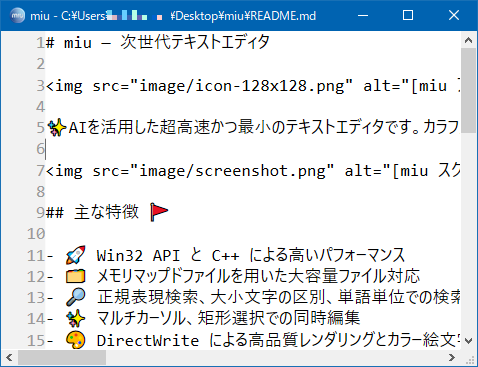

# miu — 次世代テキストエディタ

先進✨の超高速かつ最小実装のテキストエディタ📄です。カラフルな絵文字🎨に対応。非常に軽快に動作し、巨大ファイルの高速編集が可能です。

## 主な特徴 🚩

- 🚀 C++/Win32 による高いパフォーマンス
- 🎨 DirectWrite による高品質レンダリングとカラー絵文字対応
- 🗂 メモリマップドファイルを用いた巨大ファイルの高速編集
- 🔎 正規表現検索、大文字小文字の区別、単語単位での検索／置換
- ✨ マルチカーソル、矩形選択が可能
- ↩↪ 無制限の Undo／Redo
- ⌨ 豊富なショートカットキーと F1 によるヘルプ表示
- 🔒 安全なファイル操作と安定性重視の設計
- 🌙 ダークモードに対応

## 対応環境

- Windows 11 / Windows 10 / macOS / iOS / iPadOS

## 開発環境

- Visual Studio 2026

## ビルド要件

本プロジェクトは文字コード判定に Google compact_enc_det を使用しています。  
ビルドする前に、以下の手順でライブラリを用意してください。

01. git clone https://github.com/google/compact_enc_det.git

02. cd compact_enc_det

03. cmake . -G "Visual Studio 18 2026" -A x64

04. cmake --build . --config Release

生成された ced.lib をプロジェクトのライブラリパスに配置してください。

## ダウンロード ⬇

最新リリースは [Releases](https://github.com/kenjinote/miu/releases) からダウンロードできます。

## 連絡先 📬

ご意見・ご要望・バグ報告は [Issues](https://github.com/kenjinote/miu/issues) または [X/Twitter @kenjinote](https://x.com/kenjinote) までお願いいたします。
