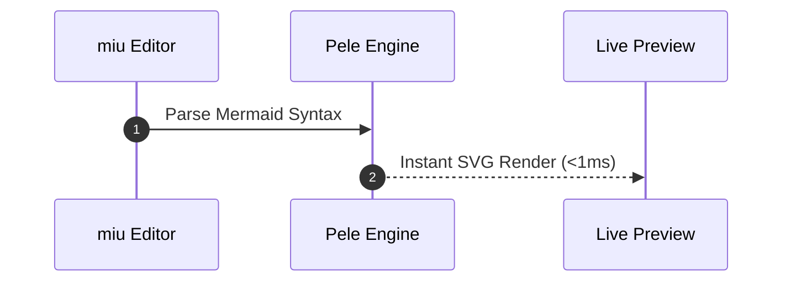
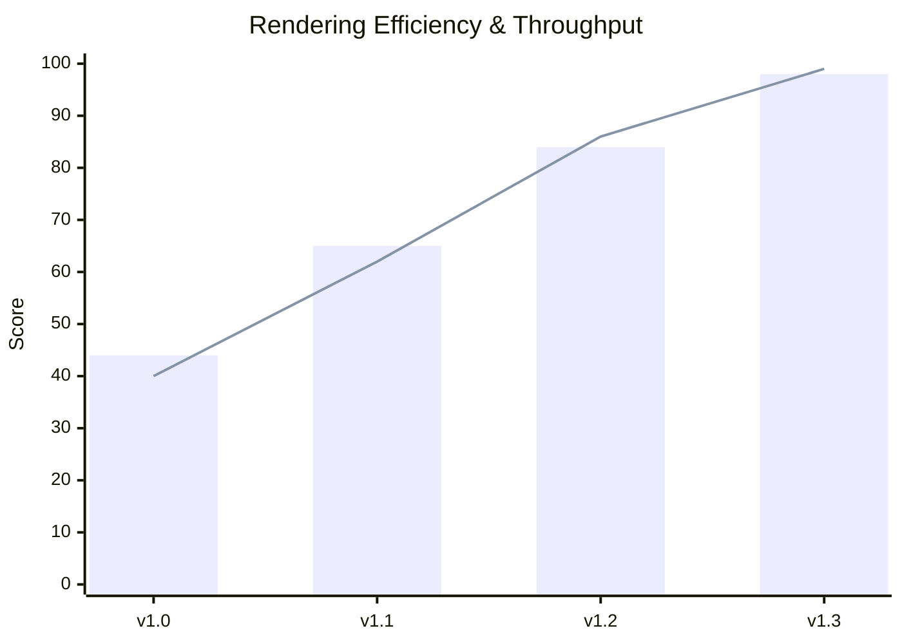

# 📊 System Architecture & Metrics

```mermaid
sequenceDiagram
  autonumber
  participant Ed as miu Editor
  participant Pl as Pele Engine
  participant Vw as Live Preview
  Ed->>Pl: Parse Mermaid Syntax
  Pl-->>Vw: Instant SVG Render (<1ms)
```

```mermaid
xychart-beta
  title "Rendering Efficiency & Throughput"
  x-axis ["v1.0", "v1.1", "v1.2", "v1.3"]
  y-axis "Score" 0 --> 100
  bar [44, 65, 84, 98]
  line [40, 62, 86, 99]
```
