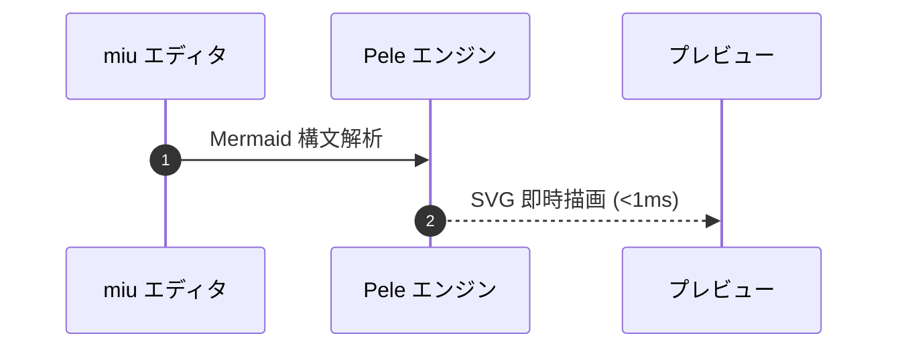
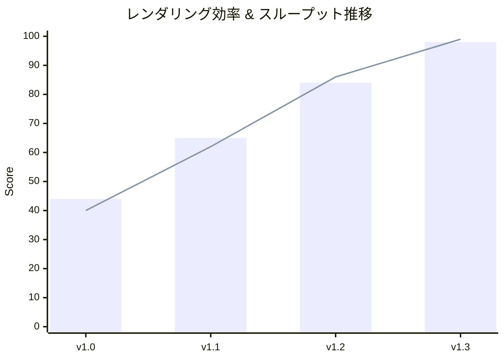

# 📊 システム設計 & メトリクス可視化

```mermaid
sequenceDiagram
  autonumber
  participant Ed as miu エディタ
  participant Pl as Pele エンジン
  participant Vw as プレビュー
  Ed->>Pl: Mermaid 構文解析
  Pl-->>Vw: SVG 即時描画 (<1ms)
```

```mermaid
xychart-beta
  title "レンダリング効率 & スループット推移"
  x-axis ["v1.0", "v1.1", "v1.2", "v1.3"]
  y-axis "Score" 0 --> 100
  bar [44, 65, 84, 98]
  line [40, 62, 86, 99]
```
