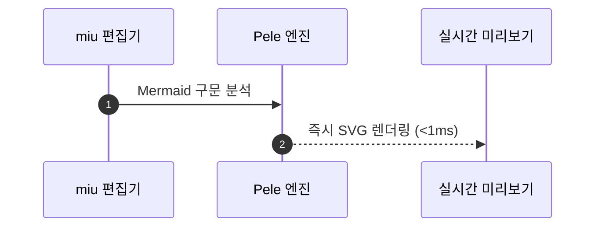
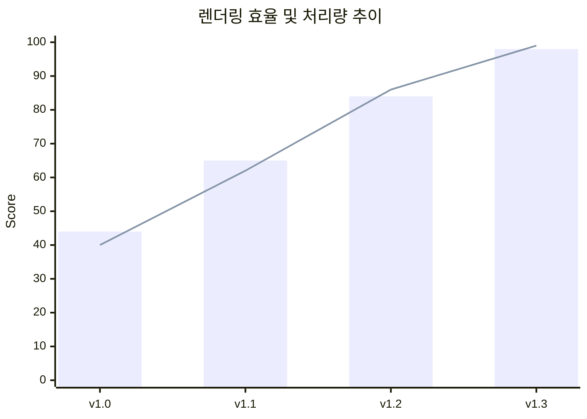

# 📊 시스템 아키텍처 & 지표 시각화

```mermaid
sequenceDiagram
  autonumber
  participant Ed as miu 편집기
  participant Pl as Pele 엔진
  participant Vw as 실시간 미리보기
  Ed->>Pl: Mermaid 구문 분석
  Pl-->>Vw: 즉시 SVG 렌더링 (<1ms)
```

```mermaid
xychart-beta
  title "렌더링 효율 및 처리량 추이"
  x-axis ["v1.0", "v1.1", "v1.2", "v1.3"]
  y-axis "Score" 0 --> 100
  bar [44, 65, 84, 98]
  line [40, 62, 86, 99]
```
