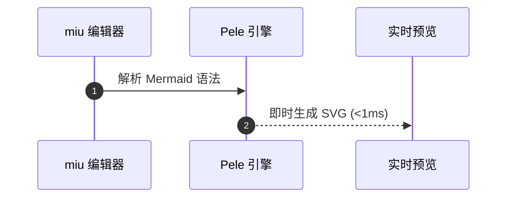
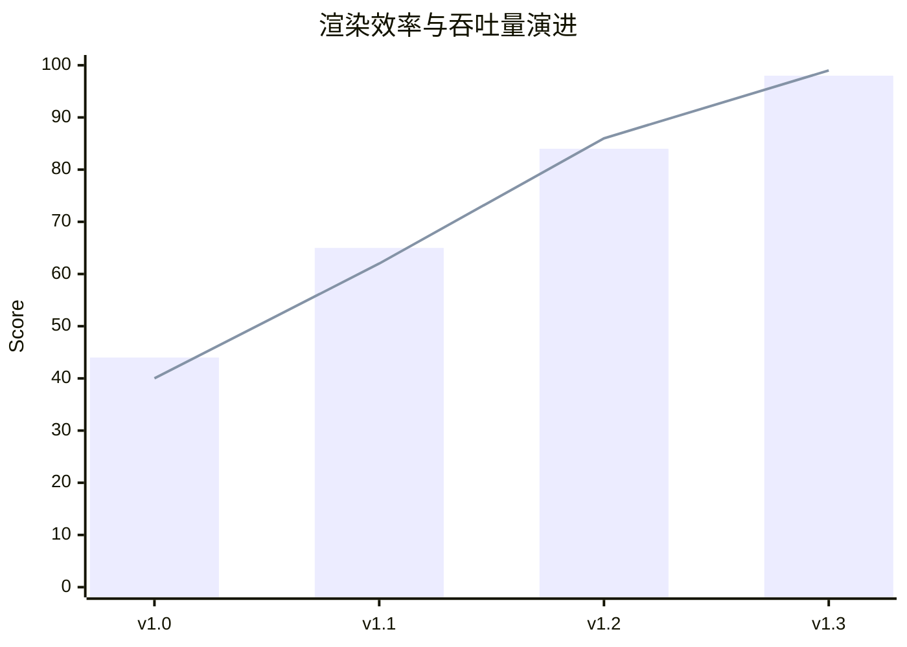

# 📊 系统架构与性能指标可视化

```mermaid
sequenceDiagram
  autonumber
  participant Ed as miu 编辑器
  participant Pl as Pele 引擎
  participant Vw as 实时预览
  Ed->>Pl: 解析 Mermaid 语法
  Pl-->>Vw: 即时生成 SVG (<1ms)
```

```mermaid
xychart-beta
  title "渲染效率与吞吐量演进"
  x-axis ["v1.0", "v1.1", "v1.2", "v1.3"]
  y-axis "Score" 0 --> 100
  bar [44, 65, 84, 98]
  line [40, 62, 86, 99]
```
