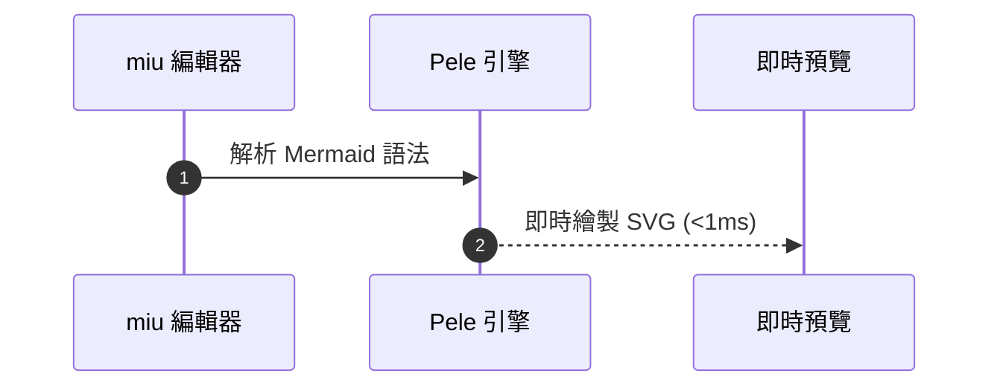
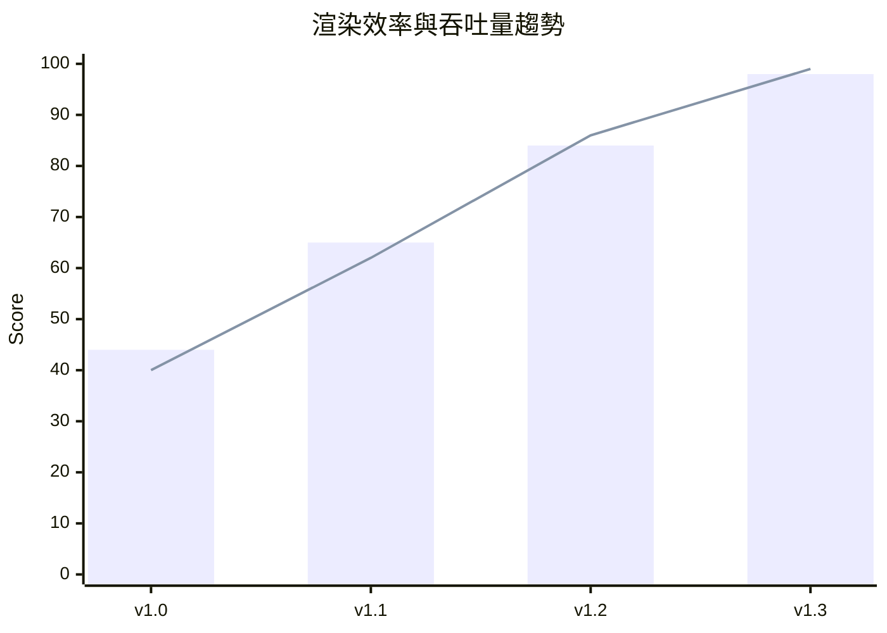

# 📊 系統架構與效能指標視覺化

```mermaid
sequenceDiagram
  autonumber
  participant Ed as miu 編輯器
  participant Pl as Pele 引擎
  participant Vw as 即時預覽
  Ed->>Pl: 解析 Mermaid 語法
  Pl-->>Vw: 即時繪製 SVG (<1ms)
```

```mermaid
xychart-beta
  title "渲染效率與吞吐量趨勢"
  x-axis ["v1.0", "v1.1", "v1.2", "v1.3"]
  y-axis "Score" 0 --> 100
  bar [44, 65, 84, 98]
  line [40, 62, 86, 99]
```
